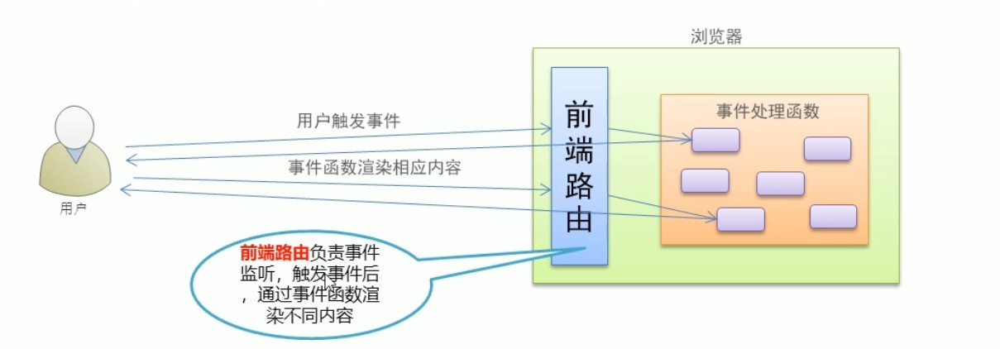

插值表达式里面支持一些运算

比如{{1+2}} 显示3

### v-text

v-text指令用于将数据填充到标签中，作用于插值表达式类似，但是没有闪动问题

如果数据中有HTML标签会将html标签一并输出

注意：此处为单向绑定，数据对象上的值改变，插值会发生变化；但是当插值发生变化并不会影响数据对象的值


在指令中不要写插值语法  直接写对应的变量名称 
        在 v-text 中 赋值的时候不要在写 插值语法
		一般属性中不加 {{}}  直接写 对应 的数据名

##### 自我点评：数据层变化，插值就会变化，但是视图层的变化，数据层不回变化

```html
<div id="app">
    <!--  
		注意:在指令中不要写插值语法  直接写对应的变量名称 
        在 v-text 中 赋值的时候不要在写 插值语法
		一般属性中不加 {{}}  直接写 对应 的数据名 
	-->
    <p v-text="msg"></p>
    <p>
        <!-- Vue  中只有在标签的 内容中 才用插值语法 -->
        {{msg}}
    </p>
</div>

<script>
    new Vue({
        el: '#app',
        data: {
            msg: 'Hello Vue.js'
        }
    });

</script>
```

###  v-html

- 用法和v-text 相似  但是他可以将HTML片段填充到标签中
- 可能有安全问题, 一般只在可信任内容上使用 `v-html`，**永不**用在用户提交的内容上
- 它与v-text区别在于v-text输出的是纯文本，浏览器不会对其再进行html解析，但v-html会将其当html标签解析后输出。

##### 自我点评：有安全问题，所以不能用在提交表单上


### v-cloak

防止页面闪烁，加载完再显示出来

```html
 <style type="text/css">
  /* 
    1、通过属性选择器 选择到 带有属性 v-cloak的标签  让他隐藏
 */
  [v-cloak]{
    /* 元素隐藏    */
    display: none;
  }
  </style>
<body>
  <div id="app">
    <!-- 2、 让带有插值 语法的   添加 v-cloak 属性 
         在 数据渲染完场之后，v-cloak 属性会被自动去除，
         v-cloak一旦移除也就是没有这个属性了  属性选择器就选择不到该标签
		 也就是对应的标签会变为可见
    -->
    <div  v-cloak  >{{msg}}</div>
  </div>
  <script type="text/javascript" src="js/vue.js"></script>
  <script type="text/javascript">
    var vm = new Vue({
      //  el   指定元素 id 是 app 的元素  
      el: '#app',
      //  data  里面存储的是数据
      data: {
        msg: 'Hello Vue'
      }
    });
</script>
</body>
</html>
```


###  v-pre

- 显示原始信息跳过编译过程
- 跳过这个元素和它的子元素的编译过程。
- **一些静态的内容不需要编译加这个指令可以加快渲染

```html
<span v-pre>{{msg}}</span>  
     <!--   即使data里面定义了msg这里仍然是显示的{{msg}}  -->
```

### v-once

- 执行一次性的插值【当数据改变时，插值处的内容不会继续更新】

##### 点评：数据改变，依然不会更新数据


### 事件修饰符

##### 点评：为了方便使用创立的功能

就比如说

键盘修饰符：

删除键

<input v-on:keyup.delete='shanChu'>

同理，可以把delete换成enter,回车键经常用于提交表单，这时候就可以用submit同样的函数绑定一起，减少代码量

还有一些按键：

1. tab
2. esc
3. space
4. up
5. down
6. left
7. right
8. delete(删除和退格键)


### 获取键盘键的值：（自定义按键）

```html
<input type="text" v-model='info' v-on:keyup='jianZhi'>
逻辑层:
methods: {
            jianZhi: function (e) {
				//传递过来一个对象
                console.log(e);
            }
        },

比如说得知a是65
视图层：
@kyeup.65='jianZhi2'
```

#### 另一种方法自定义：

```html
<div id="app">
    预先定义了keycode 116（即F5）的别名为f5hanShu，因此在文字输入框中按下F5，会触发prompt方法
    <input type="text" v-on:keydown.f5hanShu="f5han()">
</div>

<script>
	全局设置
    Vue.config.keyCodes.f5hanShu = 116;

    let app = new Vue({
        el: '#app',
        methods: {
            f5han: function() {
                alert('我是 F5！');
            }
        }
    });
</script>
```

### 自定义指令

```js
<script>
    // 自定义指令
    Vue.directive('myorder', {
        bind: function(el, bind) {
            console.log(bind);
            console.log(bind.value);
            el.style.backgroundColor = bind.value;
        }
    })
    var vueli = new Vue({
        el: '#vueInside',
        data() {
            return {
                mycolor: 'blue',
            }
        },
        methods: {}
    })
</script>
```

当然，上面例子里面的mycolor可以是一个对象，使用的时候.键名就可以了

局部的写法，上面那个是全局的写法：

```js
 // 自定义指令
    // vue实例
    var vueli = new Vue({
        el: '#vueInside',
        data() {
            return {
                mycolor: 'yellow',
            }
        },
        methods: {},
        directives: {
            'myorder': {
                bind: function(el, bind) {
                    el.style.backgroundColor = bind.value;
                }
            }
        }
    })
```

### 禁止表单提交：

使用事件修饰符 prevent

```html
<input type='submit' @click.prevent=handle>
       
methods:handle:function(){

}
```

### input和change事件区别

input事件是键盘只要输入一个字符就会改变，change则是输入框失去焦点时候触发

### 表单修饰符

v-model.lazy='msg'

把input事件改成change事件

number:转化成数值

trim:去掉首尾空格

### computed计算属性

1. 如果把逻辑写在插值表达式当中，会不利于页面的观察（审美）。
2. 并且会把数据缓存起来，如果是第二次
3. computed加工data里面的数据
4. computed不同于methods，不需要添加()

```html
视图层：
{{reverseMsg}}
逻辑层：
computed:{
	//颠倒数据
	reverseMsg:function(){
		return this.msg.split('').reverse.join('')
	}
}
```


### watch验证表单

```html
<!DOCTYPE html>
<html lang="en">

<head>
    <meta charset="UTF-8">
    <meta http-equiv="X-UA-Compatible" content="IE=edge">
    <meta name="viewport" content="width=device-width, initial-scale=1.0">
    <title>验证输入框，因为是异步 用watch</title>
    <style>
        [v-cloak] {
            /* 元素隐藏    */
            display: none;
        }
    </style>
</head>

<body>
    <div id="vueInside">
        <input type="text" v-model.lazy='username' placeholder="请输入用户名！">
        <p v-cloak>{{tip}}</p>
    </div>
</body>
<script src="./js/vue.js"></script>
<script>
    var vm = new Vue({
        el: '#vueInside',
        data() {
            return {
                username: '',
                tip: 'tip',
            }
        },
        methods: {
            verification: function (val) {
                // 定时器操作对象是windows
                var that = this;
                setTimeout(function () {
                    if (val == 'admin') {
                        that.tip = '不通过'
                    } else {
                        that.tip = '通过'
                    }
                }, 1000)
            }
        },
        // 侦听器
        watch: {
            username: function (val) {
                this.verification(val)
                this.tip='正在验证'
            },
        }
    })
</script>

</html>
```

### filter过滤器

```html
<!DOCTYPE html>
<html lang="en">

<head>
    <meta charset="UTF-8">
    <meta http-equiv="X-UA-Compatible" content="IE=edge">
    <meta name="viewport" content="width=device-width, initial-scale=1.0">
    <title>filter</title>
</head>

<body>
    <div id='vueInside'>
        <input type="text" v-model.lazy='msg' >
        <p>{{msg|msgFilter}}</p>
        多次过滤
        <p>{{msg|msgFilter|lower}}</p>
        自定义属性
        <p :abc='msg|msgFilter'></p>
    </div>
</body>
<script src="./js/vue.js"></script>
<script src="./js/jQuery-2.1.4.min.js"></script>
<script>
    // 全局过滤器
    Vue.filter('msgFilter', function (val) {
        return val.charAt(0).toUpperCase() + val.slice(1);
    })
    var vm = new Vue({
        el: '#vueInside',
        data() {
            return {
                msg: '',
            }
        },
        methods: {
         
        },
        局部过滤器
        filters: {
            msgFilter: function (val) {
                return val.charAt(0).toUpperCase() + val.slice(1);
            }
        }
    })
</script>

</html>
```

### 清除浮动clearfix

```css
.clearfix:after{/*伪元素是行内元素 正常浏览器清除浮动方法*/
    content: "";
    display: block;
    height: 0;
    clear:both;
    visibility: hidden;
}
.clearfix{
    *zoom: 1;/*ie6清除浮动的方式 *号只有IE6-IE7执行，其他浏览器不执行*/
}
```

### vue自带API修改数据，可以做到实时更新：

vue实例的API一般前面都会有$符号

```html

<!DOCTYPE html>
<html lang="en">
<head>
  <meta charset="UTF-8">
  <title>Document</title>
</head>
<body>
  <div id="app">
    <ul>
      <li v-for='item in list'>{{item}}</li>
    </ul>
    <div>
      <div>{{info.name}}</div>
      <div>{{info.age}}</div>
      <div>{{info.gender}}</div>
    </div>
  </div>
  <script type="text/javascript" src="js/vue.js"></script>
  <script type="text/javascript">
    /*
      动态处理响应式数据
      
    */
    var vm = new Vue({
      el: '#app',
      data: {
        list: ['apple', 'orange', 'banana'],
        info: {
          name: 'lisi',
          age: 12
        }
      },
    });
    // vm.list[1] = 'lemon';
    // Vue.set(vm.list, 2, 'lemon');
    vm.$set(vm.list, 1, 'lemon');

    // vm.info.gender = 'male';
    vm.$set(vm.info, 'gender', 'female');

    
  </script>
</body>
</html>

```

### vue图书馆案例

```html
<!DOCTYPE html>
<html lang="en">

<head>
    <meta charset="UTF-8">
    <meta http-equiv="X-UA-Compatible" content="IE=edge">
    <meta name="viewport" content="width=device-width, initial-scale=1.0">
    <title>library</title>
    <style>
        li {
            list-style: none;
        }
        
        .clearfix:after {
            /*伪元素是行内元素 正常浏览器清除浮动方法*/
            content: "";
            display: block;
            height: 0;
            clear: both;
            visibility: hidden;
        }
        
        .clearfix {
            *zoom: 1;
            /*ie6清除浮动的方式 *号只有IE6-IE7执行，其他浏览器不执行*/
        }
        
        .container {
            margin-bottom: 15px;
        }
        
        .container>div {
            float: left;
            border: 1px solid black;
            padding: 5px;
        }
    </style>
</head>

<body>
    <div id="vueInside">
        <ul>
            <li>
                <div :key='item.id' class="clearfix container" v-for='(item,index) in books'>
                    <div class="bookid">{{item.id}}</div>
                    <div class="bookname">
                        {{item.name}}
                    </div>
                    <div>{{item.date | format('yyyy-MM-dd hh:mm:ss')}}</div>
                    <div class="bookwriter">{{item.writer}}</div>
                    <a href="" @click.prevent='toEdit(item.id)'>修改</a>
                    <a href="" @click.prevent='toDel(item.id)'>删除</a>
                </div>
                书名：<input type="text" v-model='name' v-focus>
                <!-- id修改时候禁止修改 添加时候可以修改 -->
                id:<input type="number" v-model.num.lazy='id' :disabled='flag'> 作者：
                <input type="text" v-model='writer'>
                <div>{{tip}}</div>
                <div>{{num}}</div>
                <button class="tiJiao" @click='tiJiao' :disabled='submitFlag'>提交</button>
            </li>
        </ul>
    </div>
</body>
<script src="./js/vue.js"></script>
<script>
    // 过滤器
    Vue.filter('format', function(value, arg) {
            function dateFormat(date, format) {
                if (typeof date === "string") {
                    var mts = date.match(/(\/Date\((\d+)\)\/)/);
                    if (mts && mts.length >= 3) {
                        date = parseInt(mts[2]);
                    }
                }
                date = new Date(date);
                if (!date || date.toUTCString() == "Invalid Date") {
                    return "";
                }
                var map = {
                    "M": date.getMonth() + 1, //月份 
                    "d": date.getDate(), //日 
                    "h": date.getHours(), //小时 
                    "m": date.getMinutes(), //分 
                    "s": date.getSeconds(), //秒 
                    "q": Math.floor((date.getMonth() + 3) / 3), //季度 
                    "S": date.getMilliseconds() //毫秒 
                };
                format = format.replace(/([yMdhmsqS])+/g, function(all, t) {
                    var v = map[t];
                    if (v !== undefined) {
                        if (all.length > 1) {
                            v = '0' + v;
                            v = v.substr(v.length - 2);
                        }
                        return v;
                    } else if (t === 'y') {
                        return (date.getFullYear() + '').substr(4 - all.length);
                    }
                    return all;
                });
                return format;
            }
            return dateFormat(value, arg);
        })
        // 自定义指令
    Vue.directive('focus', {
        inserted: function(el) {
            el.focus();
        }
    })
    var vueShili = new Vue({
        el: '#vueInside',
        data() {
            return {
                books: [],

                name: '',
                id: 3,
                writer: '',
                tip: '提示信息',
                flag: false,
                submitFlag: true,
            }
        },
        methods: {
            yanZheng(val) {
                for (let i = 0; i < this.books.length; i++) {
                    if (val == this.books[i].id) {
                        this.tip = '已存在，请更换!';
                        return false;
                    } else {
                        this.tip = '可以使用'
                    }
                }
            },
            tiJiao: function() {
                if (this.flag) {
                    // 编辑 箭头函数的this是外面一层的this
                    this.books.some(item => {
                        console.log(this);
                        if (item.id == this.id) {
                            item.name = this.name
                            item.writer = this.writer
                                // 终止循环
                            return true;
                        }
                    })
                    this.flag = flase;
                } else {
                    // 添加
                    if (this.tip == '可以使用') {
                        var info = {};
                        info.id = this.id;
                        info.name = this.name;
                        info.writer = this.writer;
                        this.books.push(info);
                        // 重置
                        this.id = 0;
                        this.name = '';
                        this.writer = '';
                    }
                }


            },
            // 修改
            toEdit(id) {
                this.flag = true;
                var thisBook = this.books.filter(function(item) {
                    return id == item.id
                })
                thisBook = thisBook[0]
                this.id = thisBook.id;
                this.name = thisBook.name;
                this.writer = thisBook.writer;
                // thisBook.id = this.id;
                // thisBook.name = this.name;
                // thisBook.writer = this.writer;
                console.log(thisBook);
            },
            // 删除
            toDel(id) {
                // 第一种删除方法
                var thisBook2 = this.books.findIndex(item => {
                    // 必须return，不return则返回-1
                    return item.id == id
                })
                this.books.splice(thisBook2, 1)
                    // 第二种删除方法 反向思维 filter
                    // this.books = this.books.filter(function (item) {
                    //     return item.id != id
                    // })
            },
        },
        watch: {
            id: function(val) {
                this.yanZheng(val);
            },
            name: function(val) {
                this.submitFlag = this.books.some(function(item) {
                    return item.name == val
                })
            }
        },
        computed: {
            num: function() {
                // 必须要return
                // this.num=this.books.length
                return this.books.length
            }
        },
        mounted() {
            var data = [{
                id: 0,
                name: '三国演义',
                writer: '罗本',
                date: 2525609975000,
            }, {
                id: 1,
                name: '红楼梦',
                writer: '曹雪芹',
                date: 2525609975000,
            }, {
                id: 2,
                name: '西游记',
                writer: '吴承恩',
                date: 2525609975000,
            }];
            this.books = data;
        },
    })
</script>

</html>
```


### vue自定义组件component

```html
<!DOCTYPE html>
<html lang="en">

<head>
    <meta charset="UTF-8">
    <meta http-equiv="X-UA-Compatible" content="IE=edge">
    <meta name="viewport" content="width=device-width, initial-scale=1.0">
    <title>Document</title>
</head>

<body>
    <div id="vueInside">
        <button-counter></button-counter>
        <!-- 驼峰在逻辑层命名时候，视图层依然必须使用—方式表示,并且props同理，根本原因是DOM元素不区分大小写 -->
        <button-c></button-c>
    </div>
</body>
<script src="./js/vue.js"></script>
<script>
    // 全局组件
    Vue.component('button-counter', {
        data() {
            return {
                count: 0,
            }
        },
        template: `<div>
                    <button @click=clickNum>点击了{{count}}</button>
                    <button @click=clickNum>点击了{{count}}</button>
                </div>`,
        methods: {
            clickNum: function() {
                this.count++
            }
        },
    })
    Vue.component('buttonC', {
        data() {
            return {
                count: 0,
            }
        },
        template: `<div>
                    <button @click=clickNum>点击了{{count}}</button>
                    <button @click=clickNum>点击了{{count}}</button>
                </div>`,
        methods: {
            clickNum: function() {
                this.count++
            }
        },
    })
    var vueShili = new Vue({
        el: '#vueInside',

    })
</script>

</html>
```

### vue父子组件 父传子

```html
<!DOCTYPE html>
<html lang="en">

<head>
    <meta charset="UTF-8">
    <meta http-equiv="X-UA-Compatible" content="IE=edge">
    <meta name="viewport" content="width=device-width, initial-scale=1.0">
    <title>Document</title>
</head>

<body>
    <div id="vueInside">
        <!-- shu是自定义属性 后面的faMsg是父亲传递过来的值 -->
        <button-c :shu=faMsg></button-c>
        <div-aa></div-aa>
    </div>
</body>
<script src="./js/vue.js"></script>
<script>
    // 子组件
    Vue.component('div-aa', {
            data() {
                return {

                }
            },
            template: `<div>aaa</div>`,
        })
        // 第二个子组件
    Vue.component('buttonC', {
            data() {
                return {

                }
            },
            props: ['shu', 'shu2'],
            // 子组件写上自定义属性名就能接受
            template: `<div>
                    <button @click=clickNum>{{shu}}</button>
                </div>`,
            methods: {
                clickNum: function() {
                    this.count++
                }
            },
        })
        // 上面注册了下面的实例才能使用
    var vueShili = new Vue({
        el: '#vueInside',
        data() {
            return {
                faMsg: '父亲的话',
            }
        },
    });
</script>

</html>
```

### 子组件向父组件传值

$emit自定义时间,$event是形参，固定的写法，传递过去的值

```html
<!DOCTYPE html>
<html lang="zh-CN">

<head>
    <meta charset="UTF-8">
    <meta http-equiv="X-UA-Compatible" content="IE=edge">
    <meta name="viewport" content="width=device-width, initial-scale=1.0">
    <title>Document</title>
</head>

<body>
    <div id="vueinside">
        <p :style="{fontSize:fontSize+'px'}">父组件内容</p>
        <!-- 子组件向父亲传值 自定义事件 $event是固定的写法-->
        <zi @zifn='fufn($event)'></zi>
    </div>
</body>
<script src="./js/vue.js"></script>
<script>
    // 子组件
    Vue.component('zi', {
        template: `
        <div>
            <button @click="$emit('zifn',10)">加大字体</button>
         </div>
`,
    })
    var vueShili = new Vue(
        {
            el: '#vueinside',
            data() {
                return {
                    fontSize: 12,
                }
            },
            methods: {
                fufn: function ($event) {
                    this.fontSize += $event;
                }
            },
        }
    )
</script>

</html>
```

### 兄弟组件传值 非父子

```html
<!DOCTYPE html>
<html lang="en">

<head>
    <meta charset="UTF-8">
    <meta http-equiv="X-UA-Compatible" content="IE=edge">
    <meta name="viewport" content="width=device-width, initial-scale=1.0">
    <title>Document</title>
</head>

<body>
    <div id="vueinside">
        <bro1 @click='fun'></bro1>
        <bro2 @click='fun'></bro2>
    </div>
</body>
<script src="./js/vue.js"></script>
<script>
    var gonggong = new Vue();
    Vue.component('bro1', {
        data() {
            return {
                num: 0,
            }
        },
        template: `
        <div>
            <button @click='fun'>字体大小bro1-----{{num}}</button>
            </div>`,

        methods: {
            fun: function () {
                // 触发兄弟组件的事件
                gonggong.$emit('fun2', 1)
            }
        },
        mounted() {
            // dom元素渲染完毕进行这一步 接受兄弟组件的操作函数
            gonggong.$on('fun1', (val) => {
                this.num += val
            })
        },
    })

    Vue.component('bro2', {
        data() {
            return {
                num: 0,
            }
        },
        template: `
        <div>
            <button @click='fun'>字体大小bro2-----{{num}}</button>
            </div>`,
        methods: {
            fun: function () {
                gonggong.$emit('fun1', 3)
            }
        },
        mounted() {
            gonggong.$on('fun2', (val) => {
                this.num += val
            })
        },
    })
    var vueShili = new Vue({
        el: '#vueinside',
        data() {
            return {

            }
        },
    })
</script>

</html>
```


### vue插槽slot

```html
<!DOCTYPE html>
<html lang="en">

<head>
    <meta charset="UTF-8">
    <meta http-equiv="X-UA-Compatible" content="IE=edge">
    <meta name="viewport" content="width=device-width, initial-scale=1.0">
    <title>Document</title>
</head>

<body>
    <div id="vueInside">
        <msg>错误信息403</msg>
        <msg></msg>
    </div>
</body>
<script src="./js/vue.js"></script>
<script>
    Vue.component('msg', {
        template: `
        <div>提示信息：
		//slot里面什么不写就会传递404这个默认信息
        <slot>404</slot>
        </div>
        `,

    })

    var vueShili = new Vue({
        el: '#vueInside',

    })
</script>

</html>
```

### vue具名插槽

template也可以作为标签放在最外层并且带有name属性，具名插槽可以让插槽变得更加灵活

```html
<!DOCTYPE html>
<html lang="en">

<head>
    <meta charset="UTF-8">
    <meta http-equiv="X-UA-Compatible" content="IE=edge">
    <meta name="viewport" content="width=device-width, initial-scale=1.0">
    <title>具名插槽</title>
</head>

<body>
    <div id=vueinside>
        <div-c>
            <slot name='slot1'></slot>
            <slot name='slot2'></slot>
            <slot>balabala</slot>
        </div-c>
    </div>
</body>
<script src="./js/vue.js"></script>
<script>
    Vue.component('divC', {
        template: `
        <div>
            <slot name='slot1'>slot1内容</slot>
            <template name='slot2'>
                <h1>内容2</h1>
                <h1>内容2</h1>
            </template>
            <p>普通插槽 默认内容</p>

        </div>
        `
    })
    var vueshili = new Vue({
        el: '#vueinside',
        data() {
            return {

            }
        },
    })
</script>

</html>
```

### vue作用域插槽

父组件对于子组件的内容需要进行加工处理时候

```html
<!DOCTYPE html>
<html lang="en">

<head>
    <meta charset="UTF-8">
    <meta http-equiv="X-UA-Compatible" content="IE=edge">
    <meta name="viewport" content="width=device-width, initial-scale=1.0">
    <title>具名插槽</title>
    <style>
        .current {
            color: orange;
        }
    </style>
</head>

<body>
    <div id=vueinside>
        <div-c :shu='foods'>
            <template slot-scope='slotShu'>
                <!-- {{slotShu}} -->
                <!-- {{slotShu.info}} -->

                <span v-if='slotShu.info.id==1' class="current">
                    {{slotShu.info.name}}
                </span>
                <span v-else>
                    {{slotShu.info.name}}
                </span>
            </template>
        </div-c>
    </div>
</body>
<script src="./js/vue.js"></script>
<script>
    Vue.component('divC', {
        props:['shu'],
        // 插槽定义
        template: `
        <div>
        <li v-for='item in shu' :key='item.id'>
            <!-- :info就是自定义属性 -->
            <slot :info='item'>
                {{item.name}}
            </slot>
        </li>
        </div>
        `
    })
    var vueshili = new Vue({
        el: '#vueinside',
        data() {
            return {
                foods: [{
                    id: 0,
                    name: 'apple'
                }, {
                    id: 1,
                    name: 'pear'
                }, {
                    id: 2,
                    name: 'orange'
                }]
            }
        },
    })
</script>

</html>
```

### vue组件化开发购物车 综合案例

```html
<!DOCTYPE html>
<html lang="en">

<head>
    <meta charset="UTF-8">
    <meta http-equiv="X-UA-Compatible" content="IE=edge">
    <meta name="viewport" content="width=device-width, initial-scale=1.0">
    <title>Document</title>
    <style>
        .clearfix:after {
            /*伪元素是行内元素 正常浏览器清除浮动方法*/
            content: "";
            display: block;
            height: 0;
            clear: both;
            visibility: hidden;
        }

        .clearfix {
            *zoom: 1;
            /*ie6清除浮动的方式 *号只有IE6-IE7执行，其他浏览器不执行*/
        }

        .goodsContainer>div,
        .goodsContainer>button {
            float: left;
            width: 100px;
            text-align: center;
            font-size: 20px;
            margin-left: 20px;
        }

        .goodsContainer>button,
        .goodsContainer input {
            text-align: center;
            width: 35px;
        }

        .goodsContainer>button.delBtn {
            width: 80px;
        }

        li {
            list-style: none;
        }
    </style>
</head>

<body>

    <!-- <div class="container">
        <div class="title">
            <h1>我的商品</h1>
        </div>
        <div class="main">
            <ul>
                <li class="clearfix goodsContainer">
                    <div>小米手机</div>
                    <button>-</button>
                    <div>0</div>
                    <button>+</button>
                    <button class="delBtn">删除</button>
                </li>
            </ul>
        </div>
        <div class="total"><h3>总共0个</h3></div>
    </div> -->

    <div id="vueinside">
        <my-cart></my-cart>
    </div>
</body>
<script src="./js/vue.js"></script>
<script>
    // 标题组件
    var cartTitle = {
        props: ['username'],
        template: `<div class="title">
            <h1>{{username}}的商品</h1>
        </div>`
    }
    // 内容组件
    var cartMain = {
        props: ['goodslist'],
        template: `
        <div class="main">
            <ul>
                <li class="clearfix goodsContainer"  v-for='item in goodslist' :key='item.id'>
                    <div>{{item.name}}</div>
                    <a href='' class='sub' @click.prevent="sub(item.id)">-</a>
                    <!-- 操作要在大组件里面操作而不是小组件 -->
                    <div><input  @blur='sonChange(item.id,$event)' :value='item.num' type='number'/></div>
                    <a href='' class='add' @click.prevent="add(item.id)">+</a>
                    <button class="delBtn" @click='sonDel(item.id)'>删除</button>
                </li>
            </ul>
        </div>
        `,
        methods: {
            sonDel: function (id) {
                this.$emit('faDel', id)
            },
            // 这里需要传递两个值
            sonChange(id, event) {
                this.$emit('faChange', {
                    id,
                    num: event.target.value,
                    type: 'change'
                })
            },
            add(id) {
                this.$emit('faChange', {
                    id,
                    type: 'add'
                })
            },
            sub(id) {
                this.$emit('faChange', {
                    id,
                    type: 'sub'
                })
            },
        },
    }
    // 总数组件
    var cartTotal = {
        props: ['totalNum'],
        template: `
        <div class="total"><h3>总共{{totalNum}}元</h3></div>`
    }

    // 大组件
    Vue.component('my-cart', {
        data() {
            return {
                faUsername: 'carlos',
                faGoodsList: [{
                    id: 0,
                    name: '小米手机',
                    num: 2,
                    price: 3999

                }, {
                    id: 1,
                    name: '苹果手机',
                    num: 1,
                    price: 4999
                }],
            }
        },
        computed: {
            fuTotalNum: function () {
                var t = 0;
                this.faGoodsList.forEach(element => {
                    t += element.num * element.price
                });
                return t;
            }
        },
        // 大模板里面的小模板
        template: `
        <div class='my-cart'>
            <cart-title :username='faUsername'></cart-title>

            <cart-main :goodslist='faGoodsList'
            @faDel='faDelJu($event)'
            @faChange='faChangeJu($event)'>
            </cart-main>

            <cart-total :totalNum='fuTotalNum'></cart-total>
        </div>
        `,
        // 具体的操作必须在大组件里面操作
        methods: {
            faDelJu: function (id) {
                var thisIndex = this.faGoodsList.findIndex(item =>
                    id == item.id
                )
                this.faGoodsList.splice(thisIndex, 1)
            },
            faChangeJu: function (val) {
                console.log(val);
                if (val.type == 'change') {
                    // 找到对应的数据
                    this.faGoodsList.some(item => {
                        if (item.id == val.id) {
                            item.num = val.num;
                            return true;
                        }
                    })
                } else if (val.type == 'add') {
                    this.faGoodsList.some(item => {
                        if (item.id == val.id) {
                            item.num+=1 ;
                            return true;
                        }
                    })
                }else{
                    this.faGoodsList.some(item => {
                        if (item.id == val.id) {
                            item.num-- ;
                            return true;
                        }
                    })
                }
            },
        },
        // 包含的二级组件s
        components: {
            'cart-title': cartTitle,
            'cart-main': cartMain,
            'cart-total': cartTotal,
        }
    })

    var vueshili = new Vue({
        el: '#vueinside',
        data() {
            return {

            }
        },
    })
</script>

</html>
```


## vue路由

路由本质就是前端url地址的改变，访问后端路由，然后后端路由通过服务器访问服务器资源内容来进行响应

ajax可以做到局部渲染，但是不能做到浏览器的前进或者后退，所以有了SPA single page application 整个网站只有一个页面，内容的变化通过ajax局部实现，从而有了hash值，hash值的变化会导致浏览器历史的变化，但是不会导致整个页面的渲染。




前端路由可以提升性能

## 其他的一些心得

### 媒体查询media

大的放在前面写，小的屏幕放在后面写

```css
@media screen and (max-width:1470px) {
    #addTemplate {
        width: 45%;
        height: 280px;
    }
}

@media screen and (max-width:1240px) {
    #addTemplate {
        width: 65%;

    }
}
```

### js方法

#### findIndex

```js
 var thisBook2=this.books.findIndex(item => {
                    // 必须return，不return则返回-1 返回数组里符合条件的项的下标
                    return item.id == id
                })
```

### Button按钮点击时候产生边框的问题：

通过      outline: none;属性即可解决

# typora使用教程

\# 标题

\## 二级标题

\> 引用的话

--- ***都是表示分割线 

！[图片名](图片路径)

[超链接名](超链接地址)

--- ***都是表示分割线 

```
！[图片名](图片路径)
[超链接名](超链接地址)

```

#### 有序列表的有序列表

1. 
   1. 在有序列表里面再按ctrl+]进行缩进即可

# vscode使用技巧

1.文件图标更改方法：

ctrl+shift+p然后输入**File Icon Theme**，选择需要的图标样式即可

2.解决VSCODE"因为在此系统上禁止运行脚本"报错 bug

1. 以管理员身份运行vscode;
2. 执行：get-ExecutionPolicy，显示Restricted，表示状态是禁止的;
3. 执行：set-ExecutionPolicy RemoteSigned;
4. 这时再执行get-ExecutionPolicy，就显示RemoteSigned
————————————————
版权声明：本文为CSDN博主「阿齐啦」的原创文章，遵循CC 4.0 BY-SA版权协议，转载请附上原文出处链接及本声明。
原文链接：https://blog.csdn.net/larpland/article/details/101349586